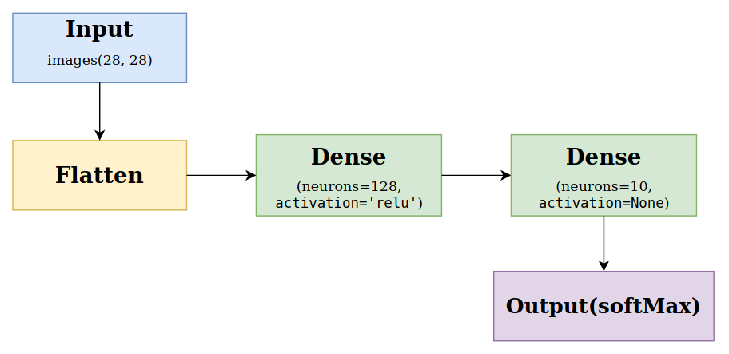

# Basic image classification with Keras

[This tutorial](https://www.tensorflow.org/tutorials/keras/classification) demonstrates basic machine learning tasks using Keras

## Diagram


## Information
- Datset: [Fashion MNIST](https://github.com/zalandoresearch/fashion-mnist)
- Optimizer: [adam](https://keras.io/api/optimizers/adam/)
- Loss: SparseCategoricalCrossentropy
- Metrics: accuracy

## Dependencies
- TensorFlow
- numpy
- matplotlib
- jupyter

## Installation and View

```
# Clone the repository
$ https://github.com/liu-boltz/machine-learning-tutoriais.git

$ cd keras-basics

# install the dependencies
# pip install --upgrade pip
$ pip install tensorflow numpy matplotlib jupyter

# exec notebook
$ jupyter notebook
```
