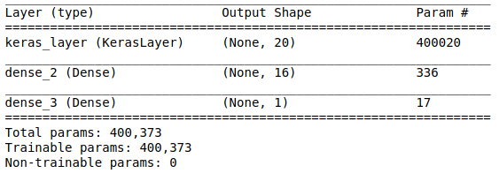

# Text classification with TensorFlow Hub: Movie reviews

[This tutorial](https://www.tensorflow.org/tutorials/keras/text_classification_with_hub) classifies movie reviews as positive or negative using the text of the review

This is an example of binary—or two-class—classification, an important and widely applicable kind of machine learning problem.

## Layers


## Information
- Dataset: [IMDB dataset](http://ai.stanford.edu/%7Eamaas/data/sentiment/)
- Optimizer: [adam](https://keras.io/api/optimizers/adam/)
- Loss: binary_crossentropy 
- Metrics: accuracy
- accuracy achieves: 87%

## Dependencies
- TensorFlow
- TensorFlow Hub
- TensorFlow datasets
- numpy
- jupyter

## Installation and View

```
# Clone the repository
$ https://github.com/liu-boltz/machine-learning-tutoriais.git

$ cd keras-basics/text-classification

# install the dependencies
# pip install --upgrade pip
$ pip install tensorflow numpy jupyter

# exec notebook
$ jupyter notebook
```
